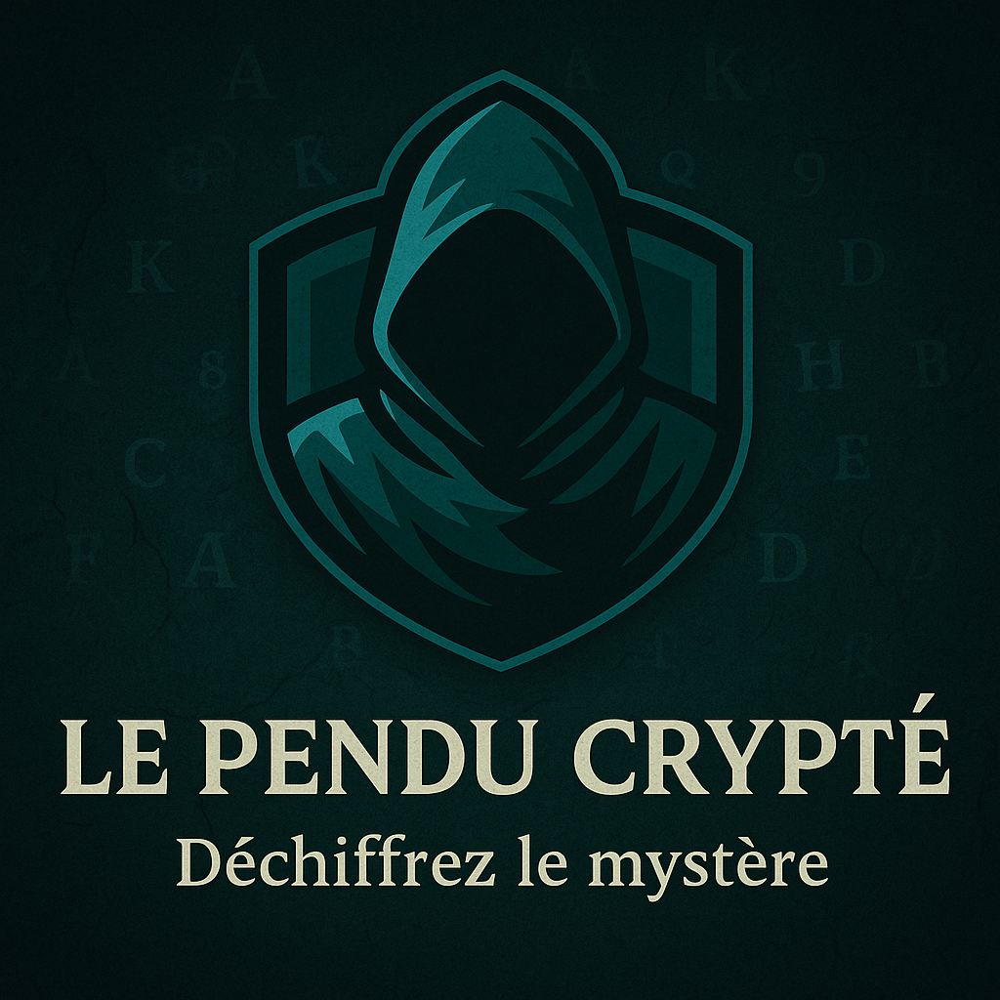

<p align="center">
  
</p>
# 🔐 Le Pendu Crypté

**Le Pendu Crypté** est un jeu web éducatif développé avec Symfony, qui initie les utilisateurs à la cryptographie à travers le célèbre chiffre de César. Le projet a été conçu à l'origine dans le cadre d’un examen, avec la volonté d’aller au-delà d’un simple projet scolaire : proposer un outil utile, réutilisable et ludique.

---

## 🌟 Fonctionnalités

- 🧠 **Deux modes de jeu** :
  - **Mode Histoire** : Décryptez un mot par chapitre pour avancer dans un récit interactif.
  - **Mode Libre** : Devinez des mots aléatoires avec 3 niveaux de difficulté.
- 👤 **Système de comptes utilisateurs** (inscription, connexion, modification, mot de passe oublié).
- 🧑‍🎨 **Création d’avatar personnalisable** via un Avatar Maker intégré.
- 📈 **Suivi des scores et progression**.
- 📨 **Formulaire de contact** avec envoi d’emails via Mailjet.
- ✅ Conforme **RGPD** (politique de confidentialité, cookies, CGU).
- 📄 **Pages informatives** : CGU, Politique de confidentialité, Histoire du code César.
- 🔍 **Optimisation SEO** via balises `meta`, `og:` et sitemap.xml.

---

## 🛠️ Stack technique

- Framework : **Symfony 6+**
- Langage : **PHP 8.2**
- Base de données : **MariaDB**
- Serveur Web : **Apache**
- Frontend : **Twig**, HTML5, CSS3
- Emailing : **Mailjet**
- Containerisation : **Docker**

---

## 🐳 Lancement avec Docker

### 🧱 Pré-requis
- Docker & Docker Compose installés

### ▶️ Lancer le projet

```bash
docker-compose up --build
